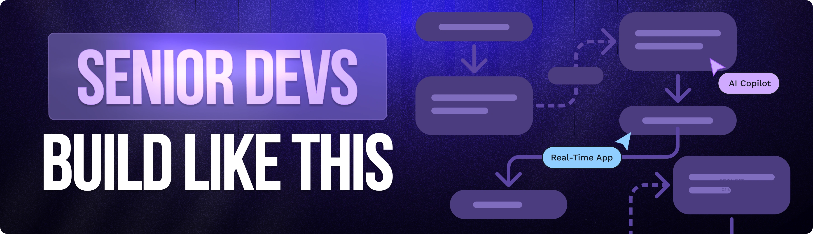

<div align="center">

  

# 👻 Ghost Arc

### AI-Powered Collaborative System Architecture Platform

> Design scalable software systems with AI, collaborate in real-time, and generate production-ready technical specifications instantly.


<br />


<br />


<br />

<a href="https://ghost-ai-zeta-seven.vercel.app/" target="_blank">
  
</a>

<a href="https://github.com/Itssanthoshhere/ghost-ai" target="_blank">
  
</a>

<a href="https://santhosh-vs-portfolio.vercel.app" target="_blank">
  
</a>

</div>

---

# 📋 Table of Contents

- [📖 About The Project](#-about-the-project)
- [✨ Features](#-features)
- [🧠 How It Works](#-how-it-works)
- [🏗️ Architecture](#️-architecture)
- [⚙️ Tech Stack](#️-tech-stack)
- [📂 Project Structure](#-project-structure)
- [🚀 Getting Started](#-getting-started)
- [🔐 Environment Variables](#-environment-variables)
- [🎯 Core AI Workflow](#-core-ai-workflow)
- [⚡ Performance Optimizations](#-performance-optimizations)
- [🧪 Future Improvements](#-future-improvements)
- [🤝 Contributing](#-contributing)
- [👨‍💻 Author](#-author)

---

# 📖 About The Project

**Ghost Arc** is an AI-powered collaborative architecture design platform that helps developers and software teams generate scalable system designs using natural language.

Instead of manually drawing architecture diagrams and writing lengthy technical documentation, users can simply describe a system like:

Design a scalable e-commerce backend with authentication,
payment gateway, Redis caching, and microservices

Ghost Arc uses **Google Gemini AI** to autonomously generate architecture nodes and connections on a collaborative React Flow canvas in real time.

Multiple users can join the same workspace, edit diagrams together, and generate production-ready technical specifications instantly.

---

## 🎯 Problem It Solves

Modern software teams often struggle with:

- Manual architecture diagram creation
- Outdated technical documentation
- Slow collaboration workflows
- Repetitive system design discussions
- Poor visibility into architectural decisions

Ghost Arc solves this by combining:

- 🤖 AI-generated architecture planning
- ⚡ Real-time multiplayer collaboration
- 🧠 AI-generated technical documentation
- 📦 Persistent project management
- 🔄 Live synchronization across users

---

# ✨ Features

## 🤖 AI Architecture Agent

Describe your system in plain English and let Gemini AI generate architecture diagrams automatically.

---

## 👥 Multiplayer Collaboration

Real-time shared canvas powered by Liveblocks:

- Live cursors
- Presence indicators
- Shared canvas state
- Synchronized editing

---

## 🧠 AI Technical Specification Generator

Generate multi-page Markdown technical specifications directly from the architecture graph.

Includes:

- System overview
- Database design
- API architecture
- Deployment recommendations
- Scalability notes

---

## 🎨 Interactive React Flow Canvas

Supports:

- Drag & drop nodes
- Resizable components
- Custom node styling
- Dynamic edges
- Inline editing
- Color customization

---

## 💾 Persistent Project Storage

Projects are stored using:

- PostgreSQL (metadata)
- Blob storage (spec files)
- JSON canvas persistence

---

## 🔐 Authentication & Access Control

Secure authentication powered by Clerk:

- Sign in / Sign up
- Protected routes
- Session handling
- User-based project access

---

## ⚡ Background AI Workflows

Long-running AI tasks handled by Trigger.dev:

- AI architecture generation
- Spec generation
- Retry handling
- Workflow orchestration

---

# 🧠 How It Works

## AI Architecture Generation Flow

```text
User Prompt
   ↓
Trigger.dev Background Task
   ↓
Gemini AI Tool Calling
   ↓
Structured Architecture Actions
   ↓
Liveblocks Storage Mutation
   ↓
Realtime Canvas Update
```

---

## Technical Specification Flow

```text
Canvas Graph
   ↓
Context Builder
   ↓
Gemini AI
   ↓
Markdown Generation
   ↓
Blob Storage Upload
   ↓
Downloadable Technical Spec
```

---

# 🏗️ Architecture

```text
┌──────────────────────────────────────────────┐
│                 Frontend                     │
│      Next.js + React + React Flow           │
└──────────────────────────────────────────────┘
                     ↓
┌──────────────────────────────────────────────┐
│                 API Layer                    │
│         Next.js Route Handlers               │
└──────────────────────────────────────────────┘
                     ↓
┌──────────────────────────────────────────────┐
│            Background Workflows              │
│                Trigger.dev                   │
└──────────────────────────────────────────────┘
                     ↓
┌──────────────────────────────────────────────┐
│               AI Processing                  │
│            Google Gemini Models              │
└──────────────────────────────────────────────┘
                     ↓
┌──────────────────────────────────────────────┐
│            Realtime Collaboration            │
│                Liveblocks                    │
└──────────────────────────────────────────────┘
                     ↓
┌──────────────────────────────────────────────┐
│                 Persistence                  │
│     PostgreSQL + Prisma + Blob Storage       │
└──────────────────────────────────────────────┘
```

---

# ⚙️ Tech Stack

| Category        | Technology     | Purpose                         |
| --------------- | -------------- | ------------------------------- |
| Frontend        | Next.js 16     | Full-stack React framework      |
| UI              | React 19       | Component-based architecture    |
| Language        | TypeScript     | Type safety                     |
| Styling         | TailwindCSS v4 | Utility-first styling           |
| Realtime        | Liveblocks     | Multiplayer collaboration       |
| Authentication  | Clerk          | Auth & user management          |
| Database        | PostgreSQL     | Persistent storage              |
| ORM             | Prisma         | Database modeling               |
| AI              | Google Gemini  | AI architecture generation      |
| Background Jobs | Trigger.dev    | Async AI workflows              |
| Flow Editor     | React Flow     | Interactive architecture canvas |
| Deployment      | Vercel         | Hosting platform                |

---

# 📂 Project Structure

```bash
ghost-ai/
│
├── app/
│   ├── api/                  # API route handlers
│   ├── editor/               # Collaborative editor pages
│   ├── sign-in/              # Clerk auth pages
│   └── sign-up/
│
├── components/
│   ├── editor/               # Canvas/editor components
│   └── ui/                   # Reusable UI primitives
│
├── hooks/                    # Custom React hooks
│
├── lib/
│   ├── ai/                   # Gemini AI logic
│   ├── liveblocks/           # Liveblocks config
│   ├── prisma/               # Prisma client
│   └── utils/
│
├── prisma/
│   ├── schema.prisma
│   └── migrations/
│
├── trigger/
│   ├── design-agent.ts       # AI architecture generation
│   └── generate-spec.ts      # AI spec generation
│
├── data/
│   ├── canvas/
│   └── specs/
│
└── types/
```

---

# 🚀 Getting Started

## Prerequisites

Make sure you have installed:

- Node.js >= 18
- npm
- PostgreSQL
- Git

---

## 1. Clone Repository

```bash
git clone https://github.com/Itssanthoshhere/ghost-ai.git

cd ghost-ai
```

---

## 2. Install Dependencies

```bash
npm install
```

---

## 3. Setup Environment Variables

Create a `.env.local` file in the root directory.

---

# 🔐 Environment Variables

```env
# Clerk

NEXT_PUBLIC_CLERK_PUBLISHABLE_KEY=

CLERK_SECRET_KEY=

NEXT_PUBLIC_CLERK_SIGN_IN_URL=/sign-in

NEXT_PUBLIC_CLERK_SIGN_UP_URL=/sign-up

━━━━━━━━━━━━━━━━━━━━

# Liveblocks

NEXT_PUBLIC_LIVEBLOCKS_PUBLIC_KEY=

LIVEBLOCKS_SECRET_KEY=

━━━━━━━━━━━━━━━━━━━━

# Trigger.dev

TRIGGER_PROJECT_REF=

TRIGGER_SECRET_KEY=

━━━━━━━━━━━━━━━━━━━━

# Database

DATABASE_URL=

━━━━━━━━━━━━━━━━━━━━

# Blob Storage

BLOB_READ_WRITE_TOKEN=

━━━━━━━━━━━━━━━━━━━━

# Google AI

GOOGLE_AI_API_KEY=

# Optional
GEMINI_MODEL=

GEMINI_SPEC_MODEL=

━━━━━━━━━━━━━━━━━━━━

APP_URL=http://localhost:3000
```

---

## 4. Setup Prisma

```bash
npx prisma generate

npx prisma migrate dev
```

---

## 5. Run Development Server

```bash
npm run dev
```

Open:

```txt
http://localhost:3000
```

---

## 6. Start Trigger.dev Worker

Open a second terminal:

```bash
npx trigger.dev@latest dev
```

---

# 🎯 Core AI Workflow

## Step 1 — User Prompt

User submits a natural language architecture request.

Example:

```txt
Build a scalable SaaS backend with Redis,
PostgreSQL, authentication, and microservices
```

---

## Step 2 — Trigger.dev Background Task

A long-running background workflow is triggered.

---

## Step 3 — Gemini AI Tool Calling

Gemini AI receives:

- system prompts
- canvas context
- available architecture tools

AI generates structured actions like:

```json
{
  "tool": "addNode",
  "input": {
    "label": "API Gateway"
  }
}
```

---

## Step 4 — Liveblocks Sync

Canvas state updates are broadcast in real time to all connected users.

---

## Step 5 — Technical Spec Generation

The final architecture graph is transformed into a detailed Markdown technical document.

---

# ⚡ Performance Optimizations

- Debounced canvas auto-save
- Background AI workflows
- Blob-based specification storage
- Incremental realtime updates
- Shared collaborative state synchronization
- Optimized React Flow rendering

---

# 🧪 Future Improvements

- [ ] AI diff previews before applying changes
- [ ] Canvas version history
- [ ] Multiplayer commenting
- [ ] Voice-based architecture generation
- [ ] AI architecture recommendations
- [ ] Dockerized deployment
- [ ] Kubernetes deployment templates
- [ ] Testing suite (Vitest + Playwright)
- [ ] Prompt injection protection
- [ ] Rate limiting & abuse prevention

---

# 🤝 Contributing

Contributions are welcome!

## Steps

```bash
1. Fork the repository
2. Create your feature branch
3. Commit your changes
4. Push to GitHub
5. Open a Pull Request
```

---

# 👨‍💻 Author

## V S Santhosh

- 🌐 Portfolio: [https://santhosh-vs-portfolio.vercel.app](https://santhosh-vs-portfolio.vercel.app)
- 💼 LinkedIn: [https://linkedin.com/in/thesanthoshvs](https://linkedin.com/in/thesanthoshvs)
- 🐙 GitHub: [https://github.com/Itssanthoshhere](https://github.com/Itssanthoshhere)

---

# 📜 License

This project is licensed under the MIT License.

---

<div align="center">

### ⭐ If you found this project interesting, consider giving it a star!

Built with ❤️ by Itssanthoshhere

</div>

---
